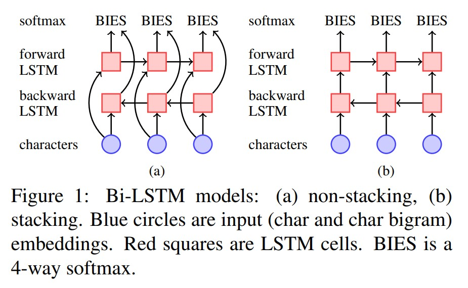
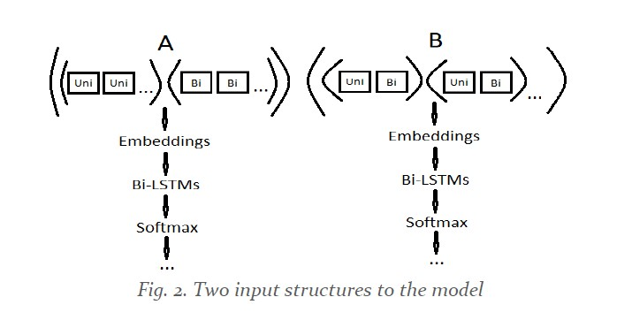

# NLP LSTM Chinese Word Segmentation

The task is to implement a [state-of-the-art Chinese word segmenter](https://www.aclweb.org/anthology/D18-1529/) - sequence tagging - model, encoding the output in the BEIS format with each character marked as belonging to one of the four classes - B (Beginning of a word), E (End of a word), I (Inside of a word), or S (Single character).

The model consists of bidirectional LSTMs, as descirbed in the images below:




[Read the report here](report.pdf)

This project was done as part of a graduate degree NLP course with [Prof. Navigli](http://wwwusers.di.uniroma1.it/~navigli/) ([BabelNet](https://babelnet.org/)) at Sapienza University of Rome and was graded as excellent.

## How to train

This repo contains an already trained model and the vocabulary from the training set in the `/resources` folder, and the validation dataset in the `/data` folder, so things can be tested rightaway.

To train, download the dataset from [this link](http://sighan.cs.uchicago.edu/bakeoff2005/), extract it into the `/data` folder, then follow the code in [the notebooks](code/unigrams_only_notebook.ipynb) in the `/code` folder to preprocess and train.

## How to test

Preprocess the test data:
```
python code/preprocess.py data/msr_test_gold.utf8 data/msr_test_gold
# python path_to_script path_to_input_dataset_to_preprocess path_to_store_input_processed_data
```

Make predictions:
```
python code/predict.py data/msr_test_gold_input.utf8 data/msr_test_gold_predicted.txt resources
# python path_to_script path_to_processed_input_file path_to_store_predictions
```

Score predictions:
```
python code/score.py data/msr_test_gold_predicted.txt data/msr_test_gold_labels.utf8
# python path_to_script path_to_predictions_file path_to_gold_file
```
